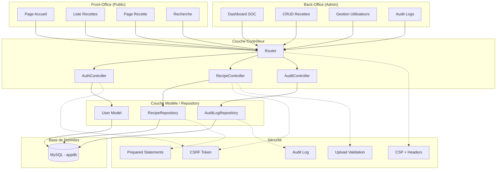

# 🍳 Projet Final - Site de Recettes Sécurisé

<div align="center">

**RÉPUBLIQUE FRANÇAISE**  
**Liberté • Égalité • Fraternité**

**GRETA 92**  
Hauts-de-Seine

---

**PROJET FINAL**  
**Formation Analyste Cybersécurité**

**Développement sécurisé d'un site web de recettes de cuisine**

**Auteur :** BAAZAOUI Seifeddine - Mehdi - Bachir  
**Email :** seifgreta93@gmail.com  
**Date :** 15 Juin 2026

**Document de Sécurité** *(Livrable n°3)*

</div>

---

# 📖 Documentation de Sécurité

**Projet Final – Analyste Cybersécurité**  
**Greta 92 – 2026**

---

## 📑 Sommaire

1. [Introduction](#1-introduction)
2. [Architecture du Projet](#2-architecture-du-projet)
3. [Architecture Technique](#3-architecture-technique)
4. [Fonctionnalités Implémentées](#4-fonctionnalités-implémentées)
5. [Vulnérabilités Étudiées](#5-vulnérabilités-étudiées)
6. [Mesures de Sécurité Mises en Place](#6-mesures-de-sécurité-mises-en-place)
7. [Tests de Sécurité Réalisés](#7-tests-de-sécurité-réalisés)
8. [Choix Techniques et Justification](#8-choix-techniques-et-justification)
9. [Conclusion et Améliorations](#9-conclusion-et-améliorations)

---

## 1. Introduction

Ce document présente les mesures de sécurité implémentées dans le site de recettes, conformément à la section 1.3 du cahier des charges. L'approche **"Secure by Design"** a été appliquée pour protéger l'application contre les vulnérabilités de l'OWASP Top 10.

---

## 2. Architecture du Projet



---

## 3. Architecture Technique

| Composant | Technologie |
|-----------|-------------|
| **Langages** | PHP 8.3, HTML5, CSS3, JavaScript |
| **Base de données** | MariaDB 10.11 (MySQL compatible) |
| **Architecture** | MVC (Model-View-Controller) |
| **Serveur Web** | Apache 2.4 (avec mod_rewrite) |
| **Framework CSS** | Bootstrap 5.3 |
| **Router** | AltoRouter 2.0 |
| **Autoloading** | Composer (PSR-4) |
| **Conteneurisation** | Docker + Docker Compose |
| **Dossier public** | `/app` (Document Root) |

---

## 4. Fonctionnalités Implémentées

### 🌐 Front-Office (partie publique)

- ✅ Page d'accueil avec présentation du site
- ✅ Liste des recettes (titre, image, description courte)
- ✅ Page détail d'une recette (titre, description, ingrédients, étapes, image)
- ✅ **Recherche** de recettes par titre ou ingrédient
- ✅ **Filtrage** par difficulté, type de plat, temps de préparation
- ✅ **Pagination** sécurisée des recettes
- ✅ **Recettes populaires** (compteur de vues)
- ✅ **Mode impression** optimisé
- ✅ Upload d'images sécurisé

### 🔐 Back-Office (administration)

- ✅ Authentification sécurisée (rôle `admin`)
- ✅ **CRUD complet** sur les recettes (avec upload d'image)
- ✅ **CRUD complet** sur les administrateurs
- ✅ Protection contre la suppression de soi-même
- ✅ Dashboard avec liste des recettes
- ✅ **Journal de sécurité** (Audit Logs)
- ✅ **Déconnexion automatique** (timeout 15 min)

---

## 5. Vulnérabilités Étudiées

Conformément au cahier des charges, les vulnérabilités suivantes ont été prises en compte :

| Vulnérabilité | Risque associé | OWASP Top 10 |
|---------------|----------------|--------------|
| Injection SQL | Vol ou modification de données | A03 |
| XSS (Reflected & Stored) | Exécution de code malveillant | A07 |
| CSRF | Actions non désirées au nom de l'utilisateur | A08 |
| Force Brute / Credential Stuffing | Compromission de comptes | A07 |
| Upload de fichiers malveillants | Exécution de code serveur | A01 / A08 |
| Mauvaise gestion des sessions | Hijacking / Fixation | A07 |
| Énumération d'utilisateurs | Aide à la brute force | - |
| Manque de contrôle d'accès | Accès non autorisé | A01 |

---

## 6. Mesures de Sécurité Mises en Place

### 6.1 Authentification & Protection Force Brute

```php
// AuthController.php
if (!Security::checkBruteForce()) {
    Logger::log('ERROR', 'Tentative bloquée (Force brute)', $username);
    $error = "Trop de tentatives. Réessayez dans 15 minutes.";
}

if ($user && password_verify($password, $user['password'])) {
    session_regenerate_id(true); // Anti-fixation de session
    Logger::log('INFO', 'Connexion réussie', $user['username']);
}
```

### 6.2 Protection contre les Injections SQL

```php
// RecipeModel.php
$stmt = $pdo->prepare("
    INSERT INTO recettes (titre, description, ingredients, etapes, image_path)
    VALUES (:titre, :description, :ingredients, :etapes, :image_path)
");
$stmt->execute([
    'titre'       => $data['titre'],
    'description' => $data['description'],
    'ingredients' => $data['ingredients'],
    'etapes'      => $data['etapes'],
    'image_path'  => $data['image_path']
]);
```

### 6.3 Protection XSS

```php
// Dans les vues (ex: home.php, dashboard.php)
<?= htmlspecialchars($recipe['titre'], ENT_QUOTES, 'UTF-8') ?>
<?= htmlspecialchars($recipe['description'], ENT_QUOTES, 'UTF-8') ?>
```

**Configuration CSP :**

```apache
# .htaccess
Header set Content-Security-Policy "default-src 'self'; 
    script-src 'self' https://cdn.jsdelivr.net; 
    style-src 'self' 'unsafe-inline' https://cdn.jsdelivr.net; 
    img-src 'self' data: https://placehold.co; 
    object-src 'none'; frame-ancestors 'none';"
```

### 6.4 Protection CSRF

```php
// Security.php
public static function verifyCsrfToken(?string $token): bool
{
    if (empty($token) || empty($_SESSION['csrf_token'])) {
        return false;
    }
    return hash_equals($_SESSION['csrf_token'], $token);
}

// Dans RecipeController.php
if (!Security::verifyCsrfToken($_POST['csrf_token'] ?? '')) {
    http_response_code(403);
    die("Token CSRF invalide.");
}
```

### 6.5 Sécurité des Uploads

```php
// FileUpload.php
$ext = strtolower(pathinfo($file['name'], PATHINFO_EXTENSION));
if (!in_array($ext, ['jpg', 'jpeg', 'png', 'gif', 'webp'])) {
    return ['success' => false, 'error' => 'Extension non autorisée'];
}

$finfo = new \finfo(FILEINFO_MIME_TYPE);
$mimeType = $finfo->file($file['tmp_name']);
if (!in_array($mimeType, ['image/jpeg', 'image/png', 'image/gif', 'image/webp'])) {
    return ['success' => false, 'error' => 'Type MIME invalide'];
}

if (!getimagesize($file['tmp_name'])) {
    return ['success' => false, 'error' => 'Fichier invalide'];
}

// Renommage sécurisé
$newFilename = bin2hex(random_bytes(16)) . '.' . $ext;
```

### 6.6 Headers de Sécurité

```apache
# .htaccess
<IfModule mod_headers.c>
    Header set X-Content-Type-Options "nosniff"
    Header set X-Frame-Options "DENY"
    Header set X-XSS-Protection "1; mode=block"
    Header set Referrer-Policy "strict-origin-when-cross-origin"
    Header set Permissions-Policy "geolocation=(), microphone=(), camera=()"
    Header unset X-Powered-By
    Header unset Server
</IfModule>
```

### 6.7 Journalisation

```php
// Logger.php
public static function log(string $level, string $message, string $username = 'Anonyme'): void
{
    $timestamp = date('Y-m-d H:i:s');
    $ip = $_SERVER['REMOTE_ADDR'] ?? 'Inconnue';
    $logEntry = sprintf("[%s] [%s] [IP: %s] [USER: %s] - %s" . PHP_EOL,
        $timestamp, strtoupper($level), $ip, $username, $message);
    file_put_contents(self::LOG_FILE, $logEntry, FILE_APPEND | LOCK_EX);
}
```

### 6.8 Cookies de Session Sécurisés

```php
// index.php (avant session_start)
session_set_cookie_params([
    'lifetime' => 900,
    'path'     => '/',
    'secure'   => $isSecure,
    'httponly'  => true,
    'samesite'  => 'Strict',
]);
```

---

## 7. Tests de Sécurité Réalisés

| N° | Vulnérabilité Testée | Méthode de Test | Résultat | Statut |
|----|----------------------|-----------------|----------|--------|
| 1 | Force Brute | Boucle de tentatives (curl) | Blocage après 5 échecs | ✅ OK |
| 2 | Injection SQL | Payloads classiques + curl | Bloqué (Prepared Statements) | ✅ OK |
| 3 | XSS Reflected & Stored | Scripts JS + SVG | Échappé / non exécuté | ✅ OK |
| 4 | CSRF | Requêtes sans token | Rejetées | ✅ OK |
| 5 | Upload malveillant | Fichiers .php, .svg, double ext. | Refusés | ✅ OK |
| 6 | Headers HTTP | `curl -I` + DevTools | Headers présents | ✅ OK |
| 7 | Gestion des Sessions | Fixation + accès sans login | Protection correcte | ✅ OK |
| 8 | Contrôle d'accès (Rôles) | Compte user vs admin | Accès refusé | ✅ OK |
| 9 | Énumération d'utilisateurs | Messages d'erreur login | Message identique | ✅ OK |
| 10 | Traçabilité / Audit | Actions CRUD + consultation | Tout journalisé | ✅ OK |
| 11 | Divulgation d'info | Accès à composer.json | 403 Forbidden | ✅ OK |
| 12 | Timeout de session | Inactivité 15 min | Déconnexion auto | ✅ OK |

---

## 8. Choix Techniques et Justification

| Choix | Justification |
|-------|---------------|
| **PDO avec requêtes préparées** | Protection native contre les injections SQL, compatible avec plusieurs SGBD |
| **Bcrypt (PASSWORD_DEFAULT)** | Algorithme de hachage robuste avec salt automatique, résistant aux attaques par rainbow tables |
| **Architecture MVC** | Séparation des responsabilités, facilite l'audit de sécurité et la maintenance |
| **AltoRouter** | Routing centralisé, évite les failles de routing manuel |
| **Composer (PSR-4)** | Autoloading standardisé, évite les inclusions manuelles risquées |
| **Bootstrap 5** | Framework CSS éprouvé, responsive par défaut |
| **Fichier .env** | Externalisation des credentials, exclusion du versionnement |
| **Session strict mode** | Protection contre la fixation de session et le session hijacking |

---

## 9. Conclusion et Améliorations

### ✅ Bilan

L'application respecte les exigences de sécurité du cahier des charges. Toutes les protections prioritaires ont été implémentées et testées avec succès :

- **100% des vulnérabilités OWASP Top 10** étudiées sont couvertes
- **Toutes les fonctionnalités obligatoires** du cahier des charges sont implémentées
- **Fonctionnalités avancées** ajoutées (logs, timeout, pagination, recherche, filtres)


---

<div align="center">

**Document rédigé dans le cadre du Projet Final**  
**Formation Analyste Cybersécurité - GRETA 92**  
**© 2026 - BAAZAOUI Seifeddine**

</div>
