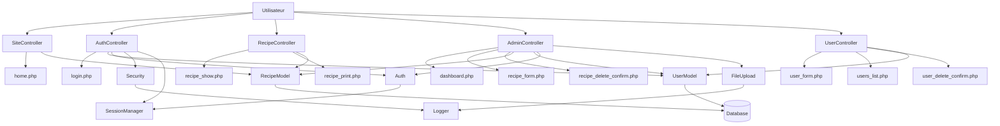

## Architecture MVC

```mermaid
graph TD

U[Utilisateur]

U --> SC[SiteController]
U --> AC[AuthController]
U --> RC[RecipeController]
U --> ADC[AdminController]
U --> UC[UserController]

SC --> HV[home.php]
AC --> LV[login.php]
RC --> RSV[recipe_show.php]
RC --> RPV[recipe_print.php]

ADC --> DASH[dashboard.php]
ADC --> RF[recipe_form.php]
ADC --> RDC[recipe_delete_confirm.php]

UC --> UF[user_form.php]
UC --> UL[users_list.php]
UC --> UDC[user_delete_confirm.php]

SC --> RM[RecipeModel]
RC --> RM
ADC --> RM

AC --> UM[UserModel]
UC --> UM
ADC --> UM

RM --> DB[(Database)]
UM --> DB

AC --> AUTH[Auth]
AC --> SEC[Security]
AC --> SM[SessionManager]

ADC --> AUTH
ADC --> FU[FileUpload]

AUTH --> SM
SEC --> LOG[Logger]
FU --> LOG
```
